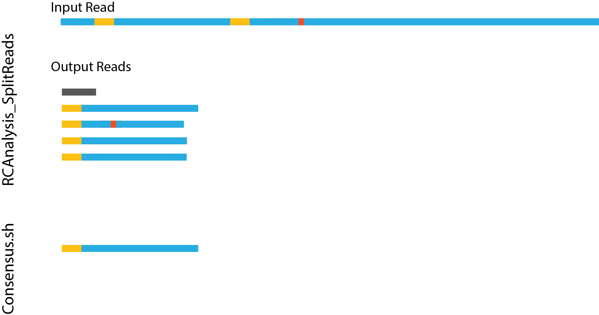

# RCAnalysis

Work in progress
TODO:
- add read count to header

## Required software/packages
lorem ipsum

## RCAnalysis_SplitReads
- Takes as input MinION fastq files and primer sequence
- Searches for the primer sequence in each read cuts them up, creating a fastq file for each
  - Has option for RCA and dumbell/LAMP methods
    - For dumbell method, has option to re-orientate reads
  - It does not remove the primer sequence, so these must be sof clipped in alignment (or trimmed before)
    - Does this cause issue with the consensus calling script? I dont think so (but its easy to edit if it does)

### Usage
| **Flag** | **Description** | **Default Value** |
| --- | --- | --- |
| -f, --fastq | The full path to the fastq file (not zipped) to process. | Require Input |
| -p, --primer | The sequence of the forward primer used. | Require Input |
| -t, --is\_dumbell | Is this a dumbell amplicon, i.e., will it forward and comp in same sequence. | NA |
| -c, --no\_dumbell\_comp | If this a dumbell amplicon, should the complemtary sequence NOT be complemented? | NA |
| -d, --distance | Maximum Levenshtein distance for primer search | 2 |
| -mx, --min\_len | Minimum length of cut sequence | 2 |
| -mn, --max\_len | Maximum length of cut sequence | 9999999 |
| -o, --out | Output folder | cwd |

## consensus.sh
- Takes as input the cut up fastq files for each read and creates a consensus for each
  - make sure only taking those with multiple reads, and then adding the singletons at the end if user wants
- Two methods available
- Output is a fastq (or fasta) file with the consensus reads (one for each *amplicon*) that can be used downstream as usual

### Citation
[Limberis, Jason D., Alina Nalyvayko, Joel D. Ernst, and John Z. Metcalfe. "Circularization of rv0678 for genotypic bedaquiline resistance testing of Mycobacterium tuberculosis." Microbiology Spectrum (2023): e04127-22.](https://journals.asm.org/doi/abs/10.1128/spectrum.04127-22)

### easyDB
https://user-images.githubusercontent.com/8179171/236018064-c66bd83c-88cc-48a8-a9c0-9d51c71da08b.mp4

### uDumBell
https://user-images.githubusercontent.com/8179171/236018231-8137537f-f6c5-4397-9387-fc140d762576.mp4

